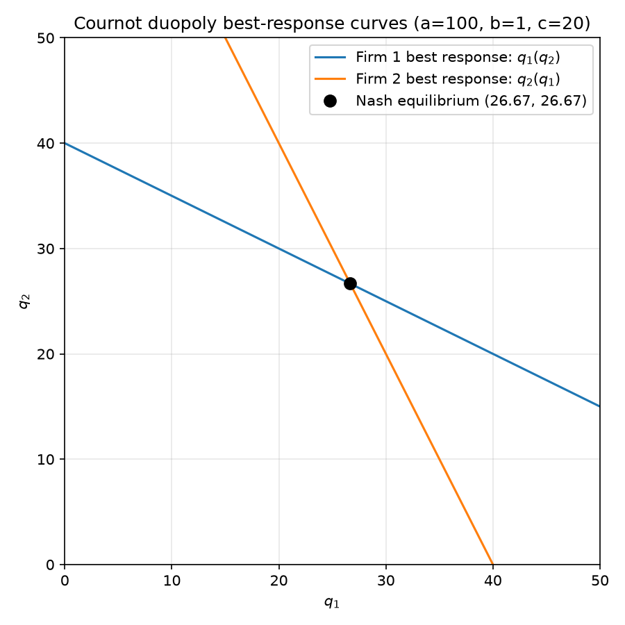
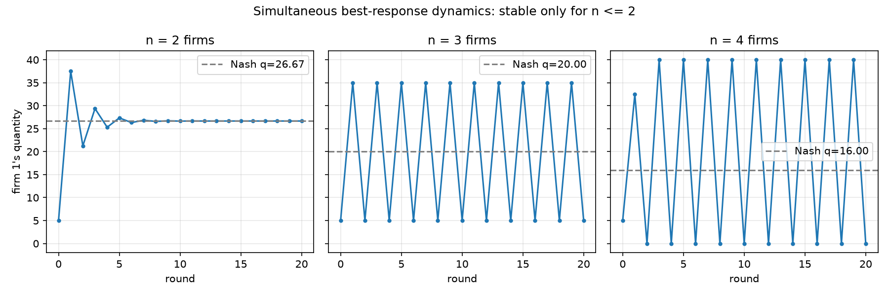
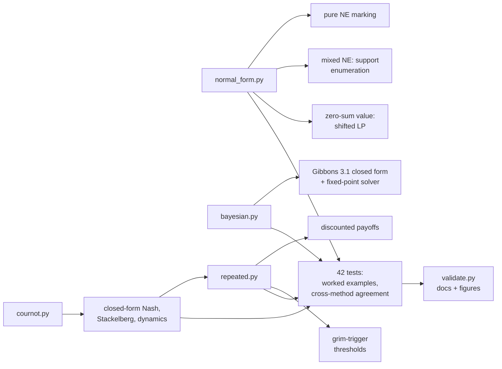
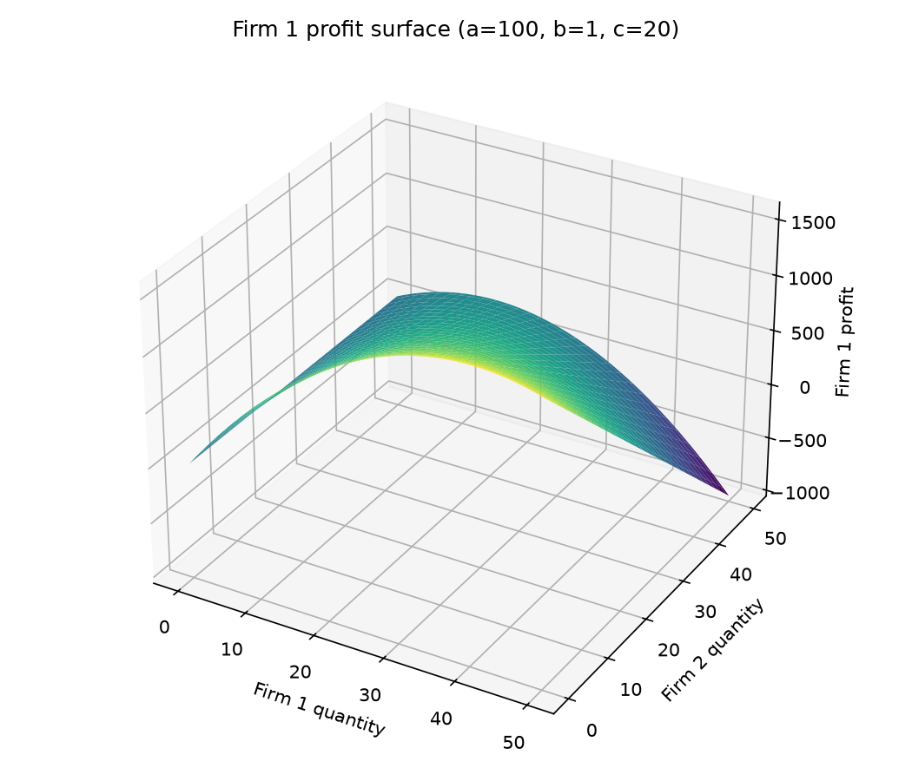

# BRFCalculator

[](https://github.com/vincal848/game-theory-equilibria/actions/workflows/tests.yml)

This project came out of a continuation of a file I worked on for my first project in
Python, expanded into a class of best-response functions after a course in game
theory. Our primary text was Robert Gibbons' *Game Theory for Applied Economists*, and
the models cover chapters 1, 3, and 4, plus material from a separate course in
Industrial Organization and Competition Economics.

I have since rebuilt it, and **every solver that wasn't a closed-form best response was
wrong.** `multi_firm_cournot` found the collusive output instead of the Cournot-Nash
equilibrium (it maximised total industry profit, not each firm's own profit). The
"Nash equilibrium" linear program had its objective sign backwards, which makes it
unbounded for essentially any input -- it returns `None` even on the module's own
worked example. The mixed-strategy solver subtracted two general-sum payoff matrices
as if the game were zero-sum. And the Bayesian solver never actually used the type
probabilities or the type-contingent utility it was handed; it computed the same
best-response-to-zero for every type.


*Both firms' best-response curves for a=100, b=1, c=20. The Nash equilibrium -- the
only point where both firms are simultaneously best-responding -- sits at (26.67,
26.67), where the legacy `multi_firm_cournot` would instead report something close to
the collusive (13.33, 13.33, 13.33) split for three firms.*

## At a glance

| | |
|---|---|
| **Methods** | Cournot best response, closed-form n-firm Nash and Stackelberg, best-response dynamics; bimatrix pure/mixed Nash by support enumeration, zero-sum LP value, dominance elimination; Bayesian Cournot (Gibbons 3.1); discounted payoffs and grim-trigger thresholds |
| **Inputs** | Linear demand intercept/slope and marginal costs; arbitrary bimatrix payoff matrices; cost-type probabilities; discount factors |
| **Outputs** | Equilibrium quantities and prices, mixed-strategy probability vectors, zero-sum game values, sustainability thresholds |
| **Validation** | 42 tests: published worked examples (matching pennies, battle of the sexes, prisoner's dilemma, rock-paper-scissors), closed-form identities, cross-method agreement (closed form vs. fixed-point solver), convergence/divergence behaviour, invalid-input errors |
| **Headline result** | The only previously-correct function in the original file was the single-firm `cournot_best_response`; every multi-agent solver was wrong |
| **Stack** | Python, NumPy, SciPy (`linprog` for the zero-sum LP) |

## Results

Every number below is produced by [`validate.py`](validate.py), which regenerates
[docs/VALIDATION.md](docs/VALIDATION.md) and the figures here.

**Cournot-Nash quantities** (a=100, b=1, c=20):

| n firms | q_i (Nash) | Total Q | Price | Collusive q_i | Competitive Q |
|---|---|---|---|---|---|
| 1 | 40.0000 | 40.0000 | 60.0000 | 40.0000 | 80.0000 |
| 2 | 26.6667 | 53.3333 | 46.6667 | 20.0000 | 80.0000 |
| 3 | 20.0000 | 60.0000 | 40.0000 | 13.3333 | 80.0000 |
| 5 | 13.3333 | 66.6667 | 33.3333 | 8.0000 | 80.0000 |
| 10 | 7.2727 | 72.7273 | 27.2727 | 4.0000 | 80.0000 |
| 50 | 1.5686 | 78.4314 | 21.5686 | 0.8000 | 80.0000 |

Total output rises monotonically with n and approaches the competitive level (80) but
never reaches it -- the textbook result that Cournot competition sits strictly between
monopoly and perfect competition.

**Best-response dynamics**, simultaneous updating, 20 rounds from q0=5:

| n firms | round 20 | behaviour |
|---|---|---|
| 2 | 26.6666 | converges to the Nash quantity |
| 3 | 5.0000 (oscillating with round 19 at 35.0) | sustained, non-decaying oscillation |
| 4 | 0.0000 (oscillating with round 19 at 40.0) | diverging, clipped at the q >= 0 floor |


*Simultaneous updating converges only for n<=2; n=3 oscillates without decaying and
n=4 grows until it hits the q>=0 floor.*

**Normal-form games**, mixed-strategy Nash equilibria by support enumeration:

| Game | Pure NE | Mixed NE |
|---|---|---|
| Matching pennies | none | p=(0.5, 0.5), q=(0.5, 0.5) |
| Battle of the sexes | (0,0), (1,1) | 2 pure + 1 strictly mixed: p=(0.667, 0.333), q=(0.333, 0.667) |
| Prisoner's dilemma | (D, D) | unique: (D, D) |
| Rock-paper-scissors | none | uniform: (1/3, 1/3, 1/3) |

**Bayesian Cournot** (Gibbons 3.1; a=100, c1=20, cH=32, cL=20):

| theta | q1 | q2(high) | q2(low) |
|---|---|---|---|
| 0.0 | 26.6667 | 20.6667 | 26.6667 |
| 0.5 | 28.6667 | 19.6667 | 25.6667 |
| 1.0 | 30.6667 | 18.6667 | 24.6667 |

At theta=0 and theta=1 this collapses exactly onto the complete-information
Cournot-Nash quantities with c2=cL and c2=cH respectively.

**Grim-trigger thresholds**: duopoly delta* = 9/17 = 0.5294 (matches
`(n+1)^2/(n^2+6n+1)` at n=2), rising to 0.6957 at n=7 -- collusion gets harder to
sustain as more firms would have to be kept in line. The classic Prisoner's Dilemma
(T=5, R=3, P=1) gives delta* = 0.5.

## How it works



**`cournot.py`.** Linear demand, constant (possibly asymmetric) marginal costs.
Everything is closed form -- best response, n-firm Nash (derived from each firm's
first-order condition, no numerical optimiser), monopoly/competitive benchmarks,
Stackelberg, and a best-response-dynamics simulator that reproduces the textbook
stability result (converges for n<=2, doesn't for n>=3).

**`normal_form.py`.** Pure Nash equilibria by marking best responses in each cell.
Mixed equilibria by support enumeration over every pair of equal-size supports,
solving the opponent-indifference linear system and checking no outside strategy does
better -- exact for nondegenerate games. Zero-sum value via a correctly-shifted LP.

**`bayesian.py`.** The Gibbons 3.1 Cournot-with-incomplete-information model: one
firm's cost is private information, the other optimises against its expectation.

**`repeated.py`.** Discounted finite/infinite payoffs, and the grim-trigger
sustainability threshold for both the Prisoner's Dilemma and symmetric Cournot
collusion, the latter computed two independent ways (from the three underlying profits,
and from the closed-form simplification) that are tested against each other.

## Decisions

- **Closed form over numerical optimisation wherever one exists.** The legacy
  `multi_firm_cournot` reached for `scipy.optimize.minimize` to solve a problem that
  has an exact algebraic answer, and in doing so solved the wrong problem (total
  profit instead of each firm's own profit). `cournot.py` has no optimiser calls.
- **Support enumeration instead of a payoff-matrix trick for mixed Nash.** Trying to
  reduce an arbitrary bimatrix game to a zero-sum LP via `A - B` only works when the
  game actually is zero-sum. Support enumeration works on general-sum games directly,
  at the cost of being exponential in the number of strategies -- fine for the
  textbook-sized games this targets.
- **Two independent routes to the Cournot grim-trigger threshold.** The closed form
  `(n+1)^2/(n^2+6n+1)` is a clean algebraic simplification, but trusting algebra you
  did once is exactly the kind of mistake the rest of this rebuild is about. Computing
  it from the three underlying profits (collusive, deviation, punishment) and testing
  that the two agree catches a mistake in either one.
- **Plotting separated from solving.** None of `cournot.py`, `normal_form.py`,
  `bayesian.py`, or `repeated.py` imports matplotlib; only `plots.py` and
  `validate.py` do, and nothing runs on import.
- **Raise on invalid inputs instead of returning a plausible-looking wrong answer.**
  Negative costs, `b <= 0`, discount factors outside `[0, 1]`, and PD payoffs that
  don't satisfy `T > R > P` all raise `ValueError` rather than silently producing a
  number, which is how most of the original defects went unnoticed in the first place.

## Quick start

```bash
pip install -r requirements.txt
```

```bash
python run.py cournot -a 100 -b 1 -c 20 -n 3
```

```
Cournot, n=3 firms, a=100.0, b=1.0, c=20.0
  Nash quantity per firm: 20.0000  (total Q = 60.0000, price = 40.0000)
  Collusive quantity per firm: 13.3333  (total Q = 40.0000)
  Competitive total Q: 80.0000
```

Other commands:

```bash
python run.py nash --game battle-of-the-sexes
python run.py bayes -a 100 --c1 20 --cH 32 --cL 20 --theta 0.5
python run.py repeated --cournot -n 2 -a 100 -b 1 -c 20
python run.py repeated --pd --T 5 --R 3 --P 1
```

From Python:

```python
import cournot
cournot.symmetric_nash_quantity(3, a=100, b=1, c=20)   # 20.0
cournot.nash_quantities(100, 1, [10, 30])               # asymmetric costs

import normal_form as nf
nf.mixed_nash_equilibria(A, B)   # support enumeration

import repeated
repeated.grim_trigger_threshold_cournot(2, 100, 1, 20)   # 0.5294... = 9/17
```

Reproduce the documentation:

```bash
pytest tests -q      # 42 tests
python validate.py   # regenerates docs/VALIDATION.md and docs/img/
```

## Repository guide

| Path | Contents |
|---|---|
| `cournot.py` | Closed-form Cournot-Nash, Stackelberg, benchmarks, best-response dynamics |
| `normal_form.py` | Pure/mixed Nash equilibria, zero-sum LP value, dominance elimination |
| `bayesian.py` | Gibbons 3.1 Cournot with incomplete information |
| `repeated.py` | Discounted payoffs, grim-trigger thresholds |
| `plots.py` | Figures. Kept out of the solving path |
| `run.py` | `cournot`, `nash`, `bayes`, `repeated` subcommands |
| `validate.py` | Regenerates `docs/VALIDATION.md` and `docs/img/` |
| `tests/` | 42 tests |
| `docs/THEORY.md` | Derivations for every closed form, with Gibbons chapter references |
| `docs/VALIDATION.md` | Full tables: quantities, dynamics, game solutions, thresholds |
| `legacy/brf_gametheory.py` | The original file, annotated. Not imported; known broken |


*Optional 3D view, same parameters as the hero figure. The ridge is firm 1's best
response curve -- the same line shown in 2D above.*

## Future interests

- **Correlated equilibrium**, via linear programming over joint distributions, as a
  natural next step after the zero-sum LP in `normal_form.py`.
- **N-player normal-form games.** Support enumeration as implemented is specific to
  two players; extending it (or switching to a different algorithm) would open up the
  n-firm, discrete-action games closest to the Cournot models here.
- **Subgame-perfect equilibrium for finitely repeated games**, including the
  chain-store-paradox-style unravelling Gibbons ch. 2.3 covers, which the current
  `repeated.py` (discounting and a single sustainability threshold) doesn't touch.
- **Differentiated-product (Bertrand) competition**, as the natural complement to
  Cournot quantity competition.

## Notes

- Reference is Gibbons, *Game Theory for Applied Economists* (1992), chapters 1, 2, 3
  (section 3.1 for the Bayesian Cournot model), and 4. Chapter numbers in the source
  refer to this edition.
- `mixed_nash_equilibria`'s support enumeration assumes the game is nondegenerate
  (Gibbons ch. 3's standing assumption for this technique) -- it is not guaranteed to
  find every equilibrium of a degenerate game (e.g. one with payoff ties that make a
  whole continuum of mixed strategies equilibria).
- `simultaneous_best_response_dynamics` floors quantities at zero, so the "divergence"
  for n>=4 shows up as the trajectory hitting that floor every other round rather than
  growing without bound in the plot.
